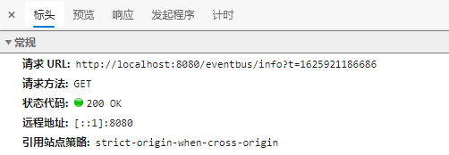

# simple-nginx
简单的 nginx `kotlin` 实现, 参考 [aruis/geekwalk](https://github.com/aruis/geekwalk)

在实现的过程中, 发现一些 `geekwalk` 项目中不完善的地方, 本项目进行了额外的补充和完善, 主要有以下内容:

## 1. 静态资源代理
在 `vertx` 中, 路径的匹配是根据配置路径的内容来进行的。

如 `/root`, 将匹配到 `/root?a=1&...`, 而 `/root/index.html` 是无法匹配到的, 所以对于静态资源的代理, 应该使用 `/root/*` 的路径进行配置。

在直播过程中, 配置使用了 `"prefix": "/web1"` 的形式, 且仅测试请求了 `/web1`, 项目中并没有这个资源, 因此等于跳转访问了 `/web1/index.html`, 所以测试通过。

但实际上, 这样配置及代码的逻辑仅能访问到 `/web1`, 其内的其它资源是不能访问到的。

## 2. webSocket 代理
在直播及测试中, 都使用了这个配置:
```json
{
  "prefix": "/",   
  "upstream": "http://127.0.0.1:8080/"
}
```
而拷贝的前端 `webSocket` 的例子, 实际上测试的是 `eventBus`, 在 html 文件内, 引入了 `vertx-eventbus.js` 依赖: 
```html
<script src="node_modules/vertx3-eventbus-client/vertx-eventbus.js"></script>
```
这个依赖会向后台发送请求获取 `eventBus` 信息: 




在代理请求后, 依旧发送 `/eventbus` 去获取 `eventBus` 信息, 由于使用 `/` 作为代理路径, 请求被代理转发了, 而实际上, 如果代理路径不为 `/`, 这个请求将会发送给代理, 等于向代理获取 `eventBus` 信息。

因此, 在本项目内, 使用了原始的 `webSocket` 进行测试。

**`requestHandler` 只处理 `http` 请求, 实际上不应该在 `requestHandler` 内来处理 `webSocket` 的建立。**
